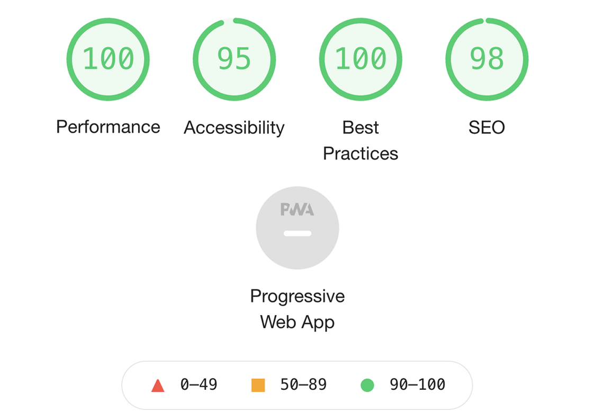

# Arrival Stockholm 

The Arrive Stockholm website is a page for visitors visiting Stockholm and looking for a personal guide. The guide (business) offers three different well known destinations, chosen by own knowledge and experience. 

On this website users will be able to find more information about the different tours that are being offered by Arrive Stockholm in order to submit an interest form. Information about the tours, dates, pricing, inspirational photos, contact information together with an interest form. 

## User Experience
- The purpose of the site is to get a quick and trustworthy overview of the service.
- The visitor should be able to easily navigate throughout the site to find information about the service provided. 
- The simpleness gives the result of visitors deciding to submit a form of interest. 
 	

## Features 
- __Navigation Bar__
    - The navigation bar includes three pages: Home page, Photos page and Interest Form page. 
    - This section will allow the user to easily navigate between the pages, across all three pages without having to go back and through the Home page. 

- __The landing page__
    - The landing page includes a photograph with text overlay, placed across the head of the page.
    - The section welcomes users to the website and grabs their attention with an eye-catching photograph.

- __The Destinations Section__
   - The Destinations section allows users to get information about the tours being offered. Followed for them all with “More…” which is linked to VisitStockholm.se for more information about each specific destination. 
   - This allows users to get an overview of what is being offered after their own interest. And to easily get more information but without being overloaded with text. The links will open in a new tab to allow easy navigation for the users.

- __About Our Tours Section__
    - The About Our Tours section gives the basic information: days and times, languages the tour offers, what is included, price per person. And minimum and maximum group sizes. 
    - This info gives the visitor the information they need to know in order to continue and submitting the Interest Form. 

- __The Footer__
    - The Footer section includes links to social media sites: Facebook, Twitter, Youtube and Instagram. The links will open to a new tab to allow easy navigation for the users. 
    - The footer is valuable to the users as it inspires them and keeps them updated on information for the future through social media.

- __Gallery__
    - The Photo section provides inspirational photography from previous tours. 
    - This is valuable to visitors wanting an overall view of the different tours offered. 

- __The Contact Page__
    - This page will allow visitors to fill in an interest form and to be contacted after their request. The form has required fields: First and last name, email, group size, requested date and the tours. 
    - This is a simple and straight-forward page, with the purpose of getting a tour booked. 

## Technologies Used 

### Languages Used
- __HTML__
- __CSS__

### Frameworks, Libraries & Programs Used
- __Google Fonts:__
    Google Fonts were used to import the font “Raleway” as the font-family into the style.css file, which are used on all pages throughout the project.

- __Font Awesome:__
     Font Awesome was used in the footer on the landing page to add icons.

- __Git:__
     Git was used for version control.

- __Gitpod:__
     Gitpod was used to provide the programming environment. 

- __GitHub:__
    GitHub is used to store the project code.

- __Photoshop:__
 Photoshop was used to resize images and edit photos for the website.

## Testing 
- This page is tested to work in different browsers: Chrome, Firefox, Safari.
- This project is responsive, readable, easy to understand and looks good on all standard screen sizes.
- This project's form works: requires entries in every field, choosing one of the options provided, confirming the submission in a new page.

### Bugs
There are no known bugs in the project.

### Validator Testing 

- HTML
  - No errors were returned when passing through the official W3C validator: 
  [index.html](https://validator.w3.org/nu/?doc=https%3A%2F%2F8000-gray-dingo-ob9ikojk.ws-eu25.gitpod.io%2Findex.html),
  [photos.html](https://validator.w3.org/nu/?doc=https%3A%2F%2F8000-gray-dingo-ob9ikojk.ws-eu25.gitpod.io%2Fphotos.html),
    [contact.html](https://validator.w3.org/nu/?doc=https%3A%2F%2F8000-gray-dingo-ob9ikojk.ws-eu25.gitpod.io%2Fcontact.html).

- CSS
  - No errors were found when passing through the official (Jigsaw) validator: [style.css](https://jigsaw.w3.org/css-validator/validator?uri=https%3A%2F%2F8000-gray-dingo-ob9ikojk.ws-eu25.gitpod.io%2Fassets%2Fcss%2Fstyle.css&profile=css3svg&usermedium=all&warning=1&vextwarning=&lang=en).

## Deployment 

- The site was deployed to GitHub pages. The steps to deploy are as follows: 
  - In the GitHub repository, navigate to the Settings tab. 
  - Select Pages in the menu.
  - From the source section drop-down menu, select the main branch.
  - Once the main branch has been selected, press Save. 

The live link can be found here -  https://emmabergner.github.io/arrival/

## Credits
__Content__
- The structure for the project was taken from the CI Love Running Project. 
- The text on home page for the destination was taken from visitstockholm.com. 
- The icons in the footer were taken from Font Awesome.

__Media__
- The images in the project was taken from Flickr.com.

